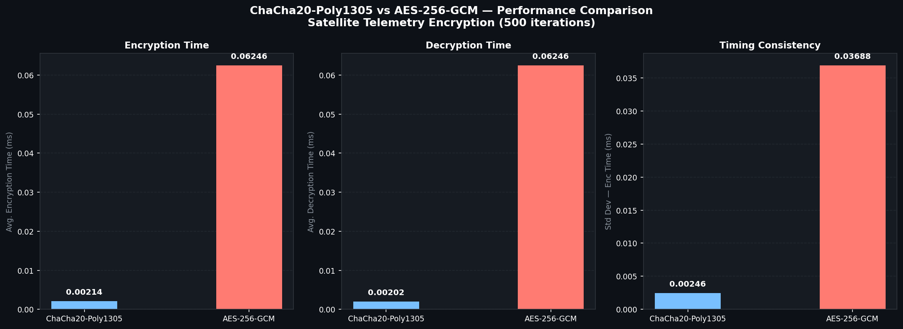
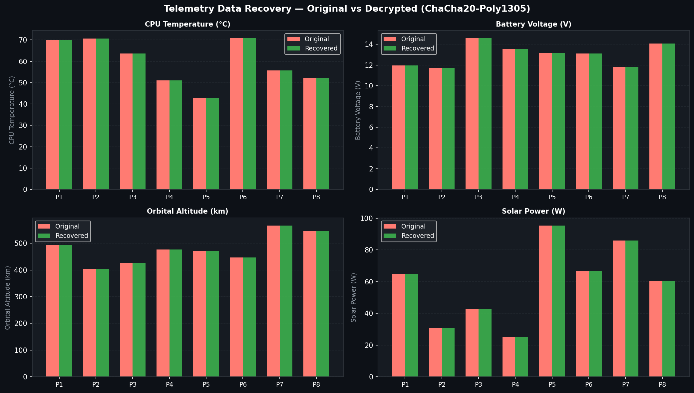
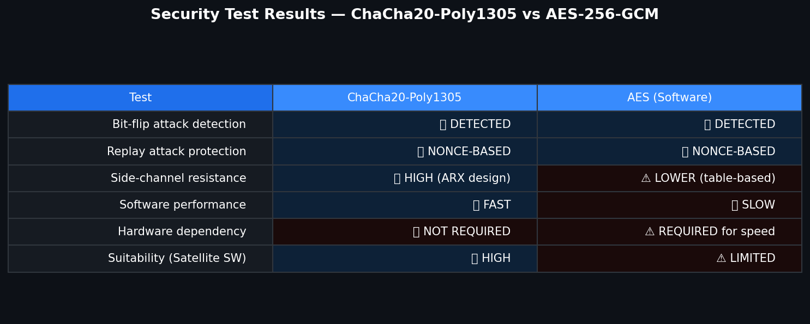
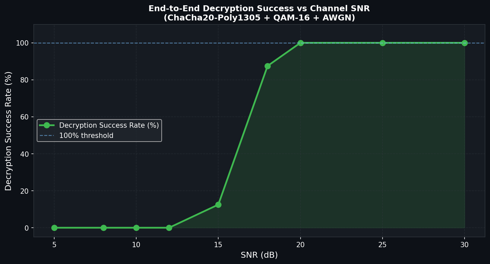
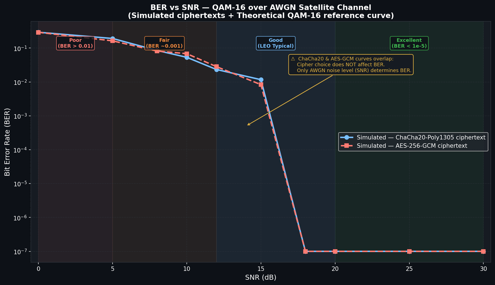
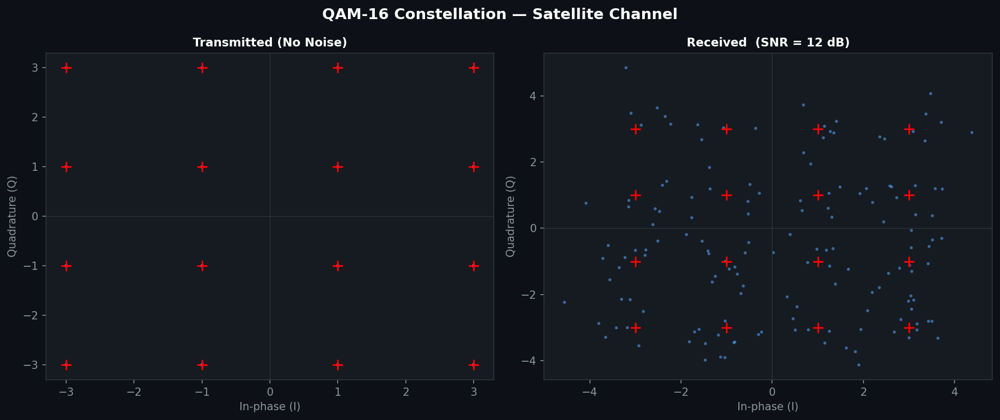

## 🚀 Live Project Demo

🔗 https://secure-satellite-telemetry-project.streamlit.app/

# 🛰 Secure Satellite Telemetry Framework

##  Project Overview

This project implements a secure satellite telemetry communication framework using the ChaCha20-Poly1305 authenticated encryption algorithm.

The system securely transmits telemetry data between a simulated satellite node and a ground base station while ensuring:

- Confidentiality
- Integrity
- Secure wireless communication
- Reliable telemetry transmission

The project was developed as a Final Year Electronics and Communication Engineering (ECE) project.

---

#  Features

-  ChaCha20-Poly1305 Encryption
-  Secure Satellite Telemetry Transmission
-  Wireless Channel Simulation
-  Performance Analysis Graphs
-  Encryption & Decryption Analysis
-  Python-Based Simulation Environment

---

#  Technologies Used

- Python 3
- Cryptography Library
- NumPy
- Matplotlib
- VS Code
- Git & GitHub

---

#  System Architecture

Satellite Node
↓
Telemetry Packet Generation
↓
ChaCha20-Poly1305 Encryption
↓
Wireless Channel Simulation
↓
Ground Base Station
↓
Decryption & Integrity Verification

---

#  Project Structure

```bash
module1_telemetry_gen.py
module2_encryption.py
module3_qam_channel.py
module4_decrypt_analysis.py
simulation_server.py
sim_bridge.py
demo_presentation.py
```

---

#  Output Results

The project generates:

- Encryption performance graphs
- BER vs SNR graphs
- Secure telemetry transmission analysis
- Channel performance evaluation

---

# Encryption Algorithm

This project uses:

ChaCha20-Poly1305

which provides:

- Authenticated Encryption
- High software efficiency
- Secure telemetry communication

---

---

# 📷 Project Output Screenshots

## 🔹 Encryption Performance Graph



---

## 🔹 Recovery Analysis Graph



---

## 🔹 Security Performance Graph



---

## 🔹 SNR vs Decryption Analysis



---

## 🔹 BER vs SNR Analysis



---

## 🔹 Constellation Diagram




# Project Objective

To design and implement a secure telemetry communication framework for satellite communication using modern authenticated encryption techniques.

---

# Author

Janarthanan T
Aravind Chockalingam M
Aswak P
Kartheeswaran M

Electronics and Communication Engineering

---

# License

This project is developed for educational and research purposes.
